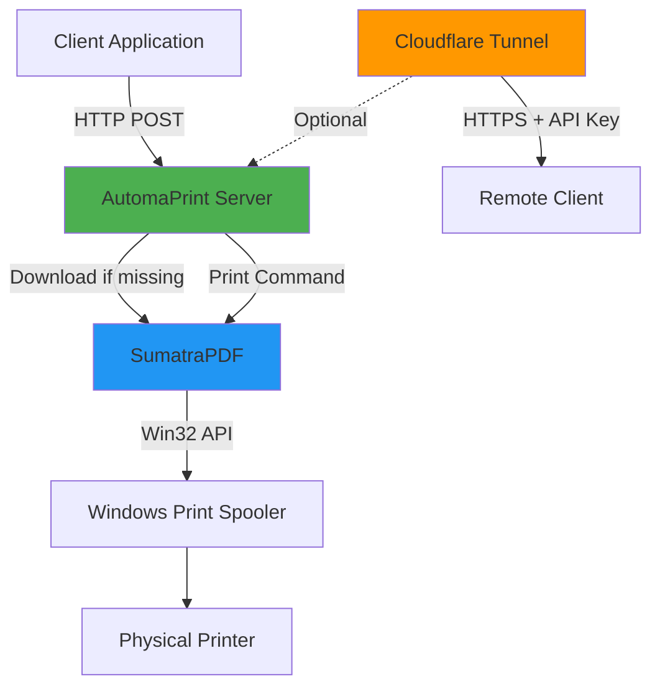

# AutomaPrint

**Windows REST API Print Server - Print PDFs from anywhere**

Turn any Windows PC with a printer into a network print server with a simple REST API. Perfect for automating document printing from web apps, scripts, or remote systems.

---

## 🚀 Quick Start

1. **Download** the latest [AutomaPrint.exe](https://github.com/ksi-digital/automaprint/releases)
2. **Run** the executable
3. **Select** your printer from the list
4. **Done!** Your print server is running at `http://localhost:8080`

**Test it:**
```bash
curl http://localhost:8080/health
```

**Print a PDF:**
```bash
curl -X POST -H "Content-Type: application/pdf" \
     --data-binary @document.pdf \
     http://localhost:8080/print
```

---

## 📖 User Guide

### System Tray Application

AutomaPrint runs in your system tray with these features:

- **Status** - Shows server status and current configuration
- **Settings** - Configure printer, port, and print options
- **Remote Access** - Enable/disable Cloudflare tunnel
- **Auto-start** - Launch automatically with Windows

### Configuration

Access settings by right-clicking the system tray icon → **Settings**

#### Print Settings

| Setting | Options | Description |
|---------|---------|-------------|
| **Scaling** | Fit / Shrink / Original | How pages fit on paper |
| **Color** | Color / Monochrome | Color or black & white |
| **Duplex** | Single / Long Edge / Short Edge | Single or double-sided |

#### Remote Access (Cloudflare Tunnel)

Enable remote printing from anywhere:

1. Open **Settings** → **Remote Access**
2. Check **Enable Cloudflare Tunnel**
3. Click **Start Server**
4. Copy the tunnel URL (e.g., `https://xyz.trycloudflare.com`)
5. Copy the API key for authentication

**Print remotely:**
```bash
curl -X POST \
     -H "Content-Type: application/pdf" \
     -H "X-API-Key: your-api-key" \
     --data-binary @document.pdf \
     https://xyz.trycloudflare.com/print
```

⚠️ **Security:** API keys are required when tunnel is enabled. Regenerate keys regularly via Settings.

### Configuration File

Settings are stored in `%USERPROFILE%\AutomaPrint\config.json`

```json
{
  "printer_name": "HP LaserJet Pro",
  "port": 8080,
  "auto_start": true,
  "minimize_to_tray": true,
  "print_scaling": "shrink",
  "print_color": "color",
  "print_duplex": "simplex",
  "use_tunnel": false,
  "api_key": "auto-generated-uuid"
}
```

### Auto-Start with Windows

Enable in **Settings** → **Auto-start with Windows**

AutomaPrint will:
- Start minimized to system tray
- Automatically launch the print server
- Use your saved configuration

### Troubleshooting

#### Printer Not Found
- Ensure printer is installed and online
- Check printer name matches exactly (case-sensitive)
- Restart AutomaPrint

#### Port Already in Use
- Change port in Settings (default: 8080)
- Check if another application is using the port

#### PDF Not Printing
- Verify PDF file is valid
- Check SumatraPDF downloaded (in `%USERPROFILE%\AutomaPrint\`)
- Test with the included `blank.pdf`

#### Firewall Blocking
Add firewall exception:
1. Windows Security → Firewall
2. Allow an app through firewall
3. Add `AutomaPrint.exe`

---

## 💻 Developer Guide

### API Reference

#### Health Check

```http
GET /health
```

**Response:**
```json
{
  "status": "ok",
  "printer": "HP LaserJet Pro",
  "version": "1.0.0"
}
```

#### Print PDF

```http
POST /print
Content-Type: application/pdf

[PDF binary data]
```

**Optional Query Parameters:**
- `printer` - Override default printer

**Headers (when tunnel enabled):**
- `X-API-Key` - Authentication key

**Response:**
```json
{
  "status": "success",
  "message": "Print job sent successfully"
}
```

**Error Response:**
```json
{
  "status": "error",
  "error": "Printer not found"
}
```

### Architecture



### Use Cases

- **Web Applications** - Print invoices, labels, receipts from your web app
- **Workflow Automation** - Integrate printing into scripts and CI/CD
- **Remote Printing** - Print from mobile apps or remote systems
- **Label Printing** - Automate shipping label printing
- **Document Processing** - Batch print generated documents

### Integration Examples

#### Python
```python
import requests

with open('document.pdf', 'rb') as f:
    response = requests.post(
        'http://localhost:8080/print',
        data=f,
        headers={'Content-Type': 'application/pdf'}
    )
    print(response.json())
```

#### JavaScript (Node.js)
```javascript
const fs = require('fs');
const axios = require('axios');

const pdf = fs.readFileSync('document.pdf');

axios.post('http://localhost:8080/print', pdf, {
  headers: {'Content-Type': 'application/pdf'}
}).then(res => console.log(res.data));
```

#### PHP
```php
$pdf = file_get_contents('document.pdf');

$ch = curl_init('http://localhost:8080/print');
curl_setopt($ch, CURLOPT_POST, true);
curl_setopt($ch, CURLOPT_POSTFIELDS, $pdf);
curl_setopt($ch, CURLOPT_HTTPHEADER, ['Content-Type: application/pdf']);
curl_setopt($ch, CURLOPT_RETURNTRANSFER, true);

$response = curl_exec($ch);
echo $response;
```

### Building from Source

**Requirements:**
- Python 3.11+
- Windows OS

**Setup:**
```bash
git clone https://github.com/ksi-digital/automaprint.git
cd automaprint

# Install dependencies
pip install -r requirements.txt

# Run in development
python main.py

# Build executable
python build.py
```

**Output:** `dist/AutomaPrint.exe`

### Development Commands

```bash
# Run GUI (default)
python main.py

# Run server only (no GUI)
python main.py server

# Show help
python main.py --help
```

### Dependencies

**Auto-Downloaded (Runtime):**
- SumatraPDF - PDF rendering engine
- cloudflared - Cloudflare tunnel client (optional)

**Python Packages:**
- Flask - REST API framework
- pywin32 - Windows API
- pystray - System tray
- Pillow - Image processing

See [requirements.txt](requirements.txt) for versions.

### Release Process

Create a new release by tagging:

```bash
git tag v1.0.0
git push origin v1.0.0
```

GitHub Actions will automatically:
- Build Windows executable
- Create GitHub release
- Attach `.exe` and `.zip` files

---

## 📄 License

MIT License - see [LICENSE](LICENSE) file.

Free to use, modify, and distribute.

---

## 🤝 Contributing

Contributions welcome! Please:

1. Fork the repository
2. Create feature branch (`git checkout -b feature/amazing`)
3. Commit changes (`git commit -m 'Add feature'`)
4. Push to branch (`git push origin feature/amazing`)
5. Open Pull Request

---

## 🐛 Support

- **Issues:** [GitHub Issues](https://github.com/ksi-digital/automaprint/issues)
- **Discussions:** [GitHub Discussions](https://github.com/ksi-digital/automaprint/discussions)

---

## 👤 Author

**KSI Digital**
- Website: [ksi-digital.com](https://ksi-digital.com)
- GitHub: [@ksi-digital](https://github.com/ksi-digital)

---

## 🙏 Acknowledgments

- [SumatraPDF](https://www.sumatrapdfreader.org/) - Lightweight PDF viewer
- [Cloudflare](https://www.cloudflare.com/) - Tunnel infrastructure
